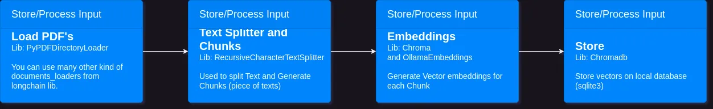
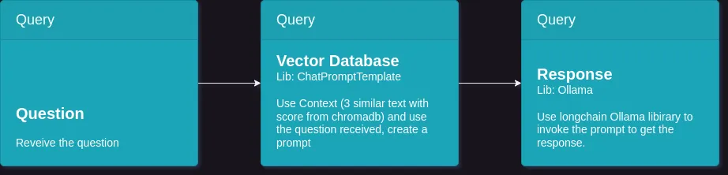

# Python RAG local with Ollama and ChromaDB

Simple, local and free RAG using Python, ChromaDB, Ollama server to receive TXT's and answer your questions.

RAG stand for Retrieval Augmented Generation here the idea is have a Ollama server running using docker in your local machine (instead of OpenAI, Gemini, or others online service), and use PDF locally to be considered during your questions.

Also there is a test script where the network will be validate the result for itself, using a prompt like this:

```
Expected Response: {expected_response}
Actual Response: {actual_response}
---
(Answer with 'true' or 'false') Does the actual response match the expected response? 
```

## Input Flow (populate_database.py)


## Query (query_data.py)



## Up and Running Ollama Server
```
cd ollama_server
docker compose up -d
```

```curl http://localhost:11343``` and you should see ```Ollama is running``` as answer

### => Load the Model

There are two ways to load models in Ollama server 

1. Using API
You can use ```ollama_server/ollama_api.http``` file to se the API details and ```donebd.rest-client-api``` VSCode plugin to call the APIs

2. Using CLI
```
docker exec -it ollama "ollama pull mistral && ollama run mistral"
```

By-the-way: 
* Mistral was better in my tests, but there is a lot models you can test! ;)
* The models are huge and you should have a good machine to run, in my local it running but the load and answer takes a long time.
* If you don´t have a good machine or don´t wanna wait for a long time, considering to use a online model like Gemini, OpenAI or others.

## Execute the App

### => Load the documents - Populate database

```
python populate_database.py
```
or you can use ```--reset``` to clean the databse before to load documents
```
python populate_database.py --reset
``` 

### => Query - Make your question
```
python query_data.py "Who was the NBA winner in 2021?"
```

### => PyTest
```
pytest
```


## Issues
To fix: Edit an existing document you should rebuild the databse from scratch


## Tech Stack
*  Python
* [Langchain](https://github.com/langchain-ai/langchain)
* [Ollama server](https://ollama.com/)
* [ChromaDB ](https://www.trychroma.com/)


#### Others
* Docker
* DevContainer - VSCode plugin
* [API Client Lite](https://marketplace.visualstudio.com/items?itemName=KomaKamaki.vscode-api-client-lite) - VSCode plugin

## Contact

- Twitter: [@mcostacurta](https://x.com/costa_curta)
- Linkedin: [@mcostacurta](https://www.linkedin.com/in/mcostacurta/)


## 📝 License

- MIT